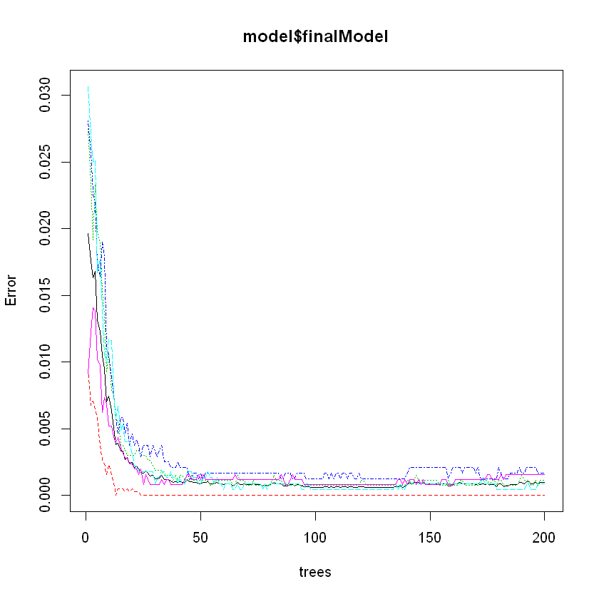

## Load Libraries


```R
library(caret)
library(rpart)
library(rpart.plot)
library(randomForest)
library(corrplot)
```

## Download The Data


```R
training <- read.csv(url("https://d396qusza40orc.cloudfront.net/predmachlearn/pml-training.csv"),header=TRUE)
testing <- read.csv(url("https://d396qusza40orc.cloudfront.net/predmachlearn/pml-testing.csv"),header=TRUE)

```

## Explore and Clean The Data


```R
dim(training)
```


<ol class=list-inline>
	<li>19622</li>
	<li>160</li>
</ol>


```R
dim(testing)
```


<ol class=list-inline>
	<li>20</li>
	<li>160</li>
</ol>


```R
# Data sample
head(training,1)
```


<table>
<thead><tr><th scope=col>X</th><th scope=col>user_name</th><th scope=col>raw_timestamp_part_1</th><th scope=col>raw_timestamp_part_2</th><th scope=col>cvtd_timestamp</th><th scope=col>new_window</th><th scope=col>num_window</th><th scope=col>roll_belt</th><th scope=col>pitch_belt</th><th scope=col>yaw_belt</th><th scope=col>...</th><th scope=col>gyros_forearm_x</th><th scope=col>gyros_forearm_y</th><th scope=col>gyros_forearm_z</th><th scope=col>accel_forearm_x</th><th scope=col>accel_forearm_y</th><th scope=col>accel_forearm_z</th><th scope=col>magnet_forearm_x</th><th scope=col>magnet_forearm_y</th><th scope=col>magnet_forearm_z</th><th scope=col>classe</th></tr></thead>
<tbody>
	<tr><td>1               </td><td>carlitos        </td><td>1323084231      </td><td>788290          </td><td>05/12/2011 11:23</td><td>no              </td><td>11              </td><td>1.41            </td><td>8.07            </td><td>-94.4           </td><td>...             </td><td>0.03            </td><td>0               </td><td>-0.02           </td><td>192             </td><td>203             </td><td>-215            </td><td>-17             </td><td>654             </td><td>476             </td><td>A               </td></tr>
</tbody>
</table>


```R
featurePlot(x=training[,-length(names(training))],y=training$classe,plot="pairs")
```

### Prediction Goal: Predict the manner they did the exercise, "classe" variable

### Remove NA Columns


```R
trainingCleaned = training[,which(colSums(is.na(training) | training =="") ==0)]
testingCleaned = testing[,which(colSums(is.na(testing) | testing =="") ==0)]
```


```R
dim(trainingCleaned)
```


<ol class=list-inline>
	<li>19622</li>
	<li>60</li>
</ol>


```R
# The testing set has more columns with NA values
dim(testingCleaned)
```


<ol class=list-inline>
	<li>20</li>
	<li>60</li>
</ol>


```R
## Remove non-predictable columns
remove = grep("X",names(training))
trainingCleaned= trainingCleaned[,-remove]
testingCleaned= testingCleaned[,-remove]
```


```R
names(trainingCleaned)
```


<ol class=list-inline>
	<li>'user_name'</li>
	<li>'raw_timestamp_part_1'</li>
	<li>'raw_timestamp_part_2'</li>
	<li>'cvtd_timestamp'</li>
	<li>'new_window'</li>
	<li>'num_window'</li>
	<li>'roll_belt'</li>
	<li>'pitch_belt'</li>
	<li>'yaw_belt'</li>
	<li>'total_accel_belt'</li>
	<li>'gyros_belt_x'</li>
	<li>'gyros_belt_y'</li>
	<li>'gyros_belt_z'</li>
	<li>'accel_belt_x'</li>
	<li>'accel_belt_y'</li>
	<li>'accel_belt_z'</li>
	<li>'magnet_belt_x'</li>
	<li>'magnet_belt_y'</li>
	<li>'magnet_belt_z'</li>
	<li>'roll_arm'</li>
	<li>'pitch_arm'</li>
	<li>'yaw_arm'</li>
	<li>'total_accel_arm'</li>
	<li>'gyros_arm_x'</li>
	<li>'gyros_arm_y'</li>
	<li>'gyros_arm_z'</li>
	<li>'accel_arm_x'</li>
	<li>'accel_arm_y'</li>
	<li>'accel_arm_z'</li>
	<li>'magnet_arm_x'</li>
	<li>'magnet_arm_y'</li>
	<li>'magnet_arm_z'</li>
	<li>'roll_dumbbell'</li>
	<li>'pitch_dumbbell'</li>
	<li>'yaw_dumbbell'</li>
	<li>'total_accel_dumbbell'</li>
	<li>'gyros_dumbbell_x'</li>
	<li>'gyros_dumbbell_y'</li>
	<li>'gyros_dumbbell_z'</li>
	<li>'accel_dumbbell_x'</li>
	<li>'accel_dumbbell_y'</li>
	<li>'accel_dumbbell_z'</li>
	<li>'magnet_dumbbell_x'</li>
	<li>'magnet_dumbbell_y'</li>
	<li>'magnet_dumbbell_z'</li>
	<li>'roll_forearm'</li>
	<li>'pitch_forearm'</li>
	<li>'yaw_forearm'</li>
	<li>'total_accel_forearm'</li>
	<li>'gyros_forearm_x'</li>
	<li>'gyros_forearm_y'</li>
	<li>'gyros_forearm_z'</li>
	<li>'accel_forearm_x'</li>
	<li>'accel_forearm_y'</li>
	<li>'accel_forearm_z'</li>
	<li>'magnet_forearm_x'</li>
	<li>'magnet_forearm_y'</li>
	<li>'magnet_forearm_z'</li>
	<li>'classe'</li>
</ol>


## Split Cross-validation Datasets


```R
set.seed(111) # For reproducibile purpose
inTrain   = createDataPartition(trainingCleaned$classe, p=0.70, list=FALSE)
trainData = trainingCleaned[inTrain, ]
testData  = trainingCleaned[-inTrain, ]
```


```R
dim(trainData)
```


<ol class=list-inline>
	<li>13737</li>
	<li>59</li>
</ol>


```R
dim(testData)
```


<ol class=list-inline>
	<li>5885</li>
	<li>59</li>
</ol>


## Data Modeling

### Ramdom Forest


```R
## Using 5-fold cross validation method
control = trainControl(method="cv", 5)
## Apply Ramdom Forest algorithm
model = train(classe ~ ., data=trainData, method="rf", trControl=control, ntree=200)
# model_CT <- train(classe~., data=trainData, method="rpart", trControl=control)
model
```


    Random Forest 
    
    13737 samples
       58 predictor
        5 classes: 'A', 'B', 'C', 'D', 'E' 
    
    No pre-processing
    Resampling: Cross-Validated (5 fold) 
    Summary of sample sizes: 10989, 10990, 10991, 10990, 10988 
    Resampling results across tuning parameters:
    
      mtry  Accuracy   Kappa    
       2    0.9877702  0.9845272
      41    0.9983257  0.9978823
      80    0.9976707  0.9970537
    
    Accuracy was used to select the optimal model using the largest value.
    The final value used for the model was mtry = 41.


```R
plot(model$finalModel)
```


    

    


#### From the graph, we can see that when the numer of trees reachs about 50, the models get to their best performances.

### Proformance of the Model


```R
Pred_Result = predict(model,testData)
```


```R
confusionMatrix(testData$classe,Pred_Result)
```


    Confusion Matrix and Statistics
    
              Reference
    Prediction    A    B    C    D    E
             A 1674    0    0    0    0
             B    1 1137    1    0    0
             C    0    1 1024    1    0
             D    0    0    1  963    0
             E    0    0    0    2 1080
    
    Overall Statistics
                                              
                   Accuracy : 0.9988          
                     95% CI : (0.9976, 0.9995)
        No Information Rate : 0.2846          
        P-Value [Acc > NIR] : < 2.2e-16       
                                              
                      Kappa : 0.9985          
                                              
     Mcnemar's Test P-Value : NA              
    
    Statistics by Class:
    
                         Class: A Class: B Class: C Class: D Class: E
    Sensitivity            0.9994   0.9991   0.9981   0.9969   1.0000
    Specificity            1.0000   0.9996   0.9996   0.9998   0.9996
    Pos Pred Value         1.0000   0.9982   0.9981   0.9990   0.9982
    Neg Pred Value         0.9998   0.9998   0.9996   0.9994   1.0000
    Prevalence             0.2846   0.1934   0.1743   0.1641   0.1835
    Detection Rate         0.2845   0.1932   0.1740   0.1636   0.1835
    Detection Prevalence   0.2845   0.1935   0.1743   0.1638   0.1839
    Balanced Accuracy      0.9997   0.9993   0.9988   0.9983   0.9998


#### Ramdom Forest gives an in-sample accuracy of 0.9988, error < 0.001, which is very good. I expected that it would be at the similar accuracy level for out-of-sample error


```R
Pred_Result_test = predict(model,testingCleaned)
```


```R
Pred_Result_test
```


<ol class=list-inline>
	<li>B</li>
	<li>A</li>
	<li>B</li>
	<li>A</li>
	<li>A</li>
	<li>E</li>
	<li>D</li>
	<li>B</li>
	<li>A</li>
	<li>A</li>
	<li>B</li>
	<li>C</li>
	<li>B</li>
	<li>A</li>
	<li>E</li>
	<li>E</li>
	<li>A</li>
	<li>B</li>
	<li>B</li>
	<li>B</li>
</ol>

<details>
	<summary style=display:list-item;cursor:pointer>
		<strong>Levels</strong>:
	</summary>
	<ol class=list-inline>
		<li>'A'</li>
		<li>'B'</li>
		<li>'C'</li>
		<li>'D'</li>
		<li>'E'</li>
	</ol>
</details>


```R

```


```R

```


```R

```
